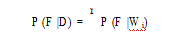

# PAPER
With the current political climate and parties more polarized than ever, the dissemination of accurate and unbiased information is more important than ever. However, there are limited resources for automatically identifying fake news articles on the Internet. Most modern machine learning pipelines that utilize deep neural networks (DNNs), which can model complex language features such as grammar, have been proven to be effective but computationally expensive (Ruchansky et. al,2017). I explore the use of Bayesian methods for document classification, analogous to methodologies used for automatic spam filtering (Sahami et. al, 1998).

# 1 - Methodology

I treat the problem as a conditional probability task using Bayes’ theorem, where my classifier attempts to predict the likelihood of a class (i.e. fake or real) given a document D. More specifically, I attempt to find the likelihood that a word W is likely to be from a fake news document with class F, and then combine those probabilities to generate a prediction for the whole document. The simple Bayes’ formula can be expressed as follows.

For my purposes, the extended form of Bayes’ theorem was particularly useful,  because P (W ) could be expressed in terms of P (W |F ) and P (F ), under the assumption that classes F  (fake) and ¬F (real) are mutually exclusive. P (W |F ) is the frequency of word W in all fake documents in the training set, P(F ) is the frequency of documents of class F .

Finally, I calculate the likelihood of a document being fake, under the assumption that the likelihoods of words appearing in fake and real documents are independent, by multiplying the P (F |Wi) for all words in the given document.

Because this is a binary classification problem, if the P (F |D) > P (¬F |D),I can infer that the document is likely to be fake.

# 2 - Solution

The quantity of data required in order to produce accurate predictions is well beyond the realm of manual calculation, so I wrote a program using Python to calculate the probabilities for the Bayes classifier. This also gave me the opportunity to further optimize my data set.

# 2.1 - Dataset

My dataset came from a compilation of two datasets independently published on the popular open-source software website GitHub. The dataset was used in research published by Horne et. al, 2017. The first half of the dataset consisted of Buzzfeed Political News Data, categorized accordingly by analysts at Buzzfeed.  The second half of the dataset included randomly collected political news data from real sources (i.e.  Wall Street Journal, The Economist, BBC, NPR, USA Today, etc.)  and fake sources (i.e.  True Pundit, DC Gazette, Liberty Writers News, InfoWars, etc.).  For the random political news partition, the sources were verified as real or fake based on Business Insider’s "Most Trusted" list and Zimdars 2016 Fake News list.

For my purposes, I combined the two partitions of the original dataset into two categories, one sample of 128 real news articles and another sample of 123 fake news articles.

# 2.2 - Document Preprocessing & Tokenization

Using Regular Expression tokenization, I was able to remove punctuation and more easily segment words in a given document. I also removed stop words, or words that appear frequently and give little indication of class, such as "the", "and" or "as".  Given the stop words’ frequency, even small variations in their usage could be enough to drown out the words that are good indicators of a particular class.

# 2.3 - Results

Using the methodology described in Section 1, I trained my classifier on a sample of 128 real and
123 fake documents consisting of 128,858 words (71,731 after the removal of stop words).  As a result, my program was able to predict the class of a document it had never seen before with 77.6% accuracy. The false positive rate for misclassifying a real news article as fake was 5.4% and the false negative rate was 38.5%.

# 3 - Discussion

Although the Bayesian method remain one of the most simple techniques for automatic document classification, it is still fairly effective and would have been state-of-the-art in the late 1990s and early
2000s.  However, as the accessibility and speed of processors increase as a result of Moore’s Law, modern machine learning techniques that are able to represent higher dimensional vector spaces and model language are beginning overcome their computational cost curves.  Previously only used on the industrial level, these methods are starting to become viable alternatives to the Bayesian method on smaller scales like with personal email spam detection.

# 3.1 - Advantages

Due to the simplicity of Bayes theorem, training a Bayesian classifier requires very little computational power and can be performed within computer applications such as email.  In addition, a user
can fine-tune a model to make predictions on certain words that are specific to that user, such as names of relatives or services that a user knows are not spammers.  Most importantly, the Bayes classifier does not need to have any working knowledge of English language, an abstract form of communication, and can perform generally accurate predictions without knowing the actual meaning of words.

The simple technique I explored has a plethora of applications: sentiment analysis, bias removal, spam filtering, and almost any other classification problem where the features analyzed can be said to be independent. On that note, there are a variety of disadvantages.

# 3.2 - Disadvantages

Because the Bayes classifier learns to make predictions based on the likelihoods of certain words, the classifier is susceptible to Bayesian poisoning, a type of attack where spammers or news writers embed phrases from real sources to confuse the classifier. In addition, disguising text by embedding it in an non-machine-readable image prevents the computer from taking that text into account when making its prediction.

My model’s accuracy also suffered from the fact that it was trained on a relatively small dataset. Initially, I trained my model on half of the original dataset, and received an accuracy score of
60% on my test data, which indicates that the Bayesian model improves with more data. In general, training on more data will educate the model on other contexts, regularize its output, and prevent optimistic prediction. However, little can be done to prevent the model from being unreliable when large quantities of data are not available.

# 3.3 - Improvements

One commonly used technique that goes beyond stop word removal is to only consider a small set of the top N words most associated with a class. However, choosing how large N should be is difficult, as too small of an N will sacrifice some of the model’s flexibility. Given more time, I could have performed additional experiments with varying values of N and integrated this optimization into my program.  As previously discussed, techniques that can model language have been developed, but require calculus-based methods that can be computationally expensive and are beyond the scope of this project.  They would, however, be able to solve problems that arise from my assumption that word occurrence is independent when in reality word occurrence is inherently dependent.  Finally, my accuracy could have been improved with access to more, higher quality data.

# References

[1] Benjamin D. Horne:  "This Just In:  Fake News Packs a Lot in Title, Uses Simpler, Repetitive Content in
Text Body, More Similar to Satire than Real News", 2017; arXiv:1703.09398.

[2] Graham, Paul. "Better Bayesian Filtering." Paul Graham, Jan. 2003, www.paulgraham.com/better.html.

[3] Jurafsky, Dan, and James H. Martin.  "Chapter 6:  Naive Bayes and Sentiment Classification." Speech and Language Processing: an Introduction to Natural Language Processing, Computational Linguistics, and Speech Recognition, Dorling Kindersley Pvt, Ltd., 2014.

[4] M. Sahami,  S. Dumais,  D. Heckerman,  and E. Horvitz.   1998.   A Bayesian Approach to Filtering Junk
E-Mail.  In Learning for Text Categorization:  Papers from the 1998 Workshop.  AAAI Technical Report WS-
98-05.

[5]  Natali  Ruchansky,  Sungyong  Seo:   "CSI:  A  Hybrid  Deep  Model  for  Fake  News  Detection",  2017;
arXiv:1703.06959. DOI: 10.1145/3132847.3132877.
